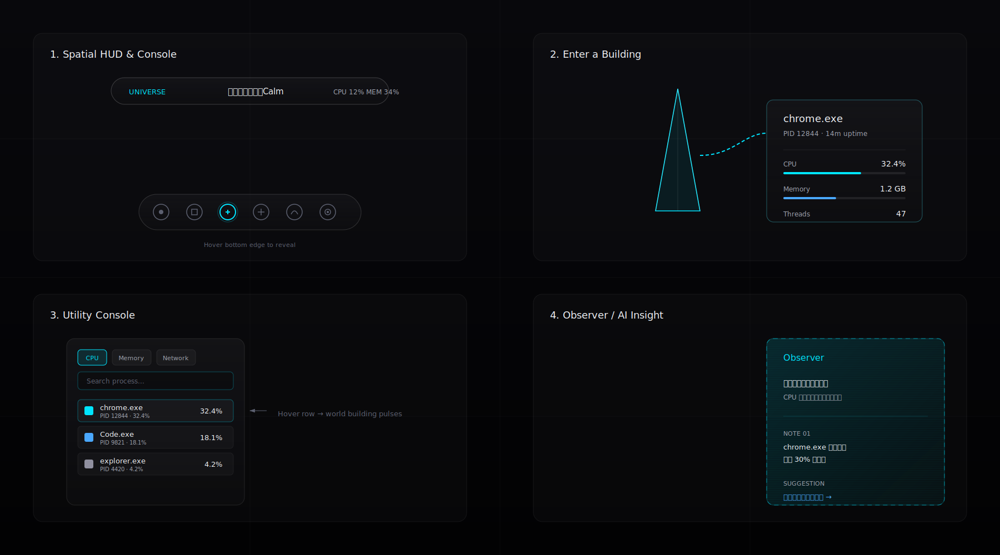

# Procession UI Design System v2.0

> **文档身份**：本文件是 Procession 前端界面与交互体验的宪法级设计规范。它不是“一套组件库”，而是一份“观测仪器设计手册”。任何后续实现、重构、新增 UI 都必须先回到这里验证：它是否让用户更相信自己正在操作一台来自未来文明的观测设备，而不是在使用一款传统软件。
>
> **适用范围**：Tauri 2.x 桌面应用、全屏/窗口模式、未来空间设备（visionOS / spatial computing）预留。
>
> **版本**：v2.0  
> **最后更新**：2026-07-18

---

## 1. 设计宣言：Procession 是一台观测仪器

Procession 的界面不是“软件 UI”。它是用户进入个人数字文明时握持的**观测仪器**。

- **世界才是主角。** UI 只是镜头、探针、控制台与回声。
- **默认不可见。** 当用户凝视世界时，屏幕应尽可能只剩世界本身。
- **只在需要时出现。** 当用户靠近、聚焦、询问，仪器才从黑暗中浮现。
- **每一次交互都是对世界的一次操作。** 切换模式不是换页面，而是更换观测透镜；点击建筑不是打开详情，而是把探针伸入建筑内部。
- **信息必须被感知，而不是被阅读。** 数字只是对现象的确认，现象的第一次表达必须是世界的变化。

---

## 2. 核心设计原则

### 2.1 世界优先，UI 隐形

- 启动后不应出现菜单、标题页或 Dashboard。用户直接进入数字空间。
- 所有控件默认隐藏或极度低调，只在触发时出现。
- 禁止任何让用户产生“我在看一个软件面板”的元素。

### 2.2 仪器化语义

用观测仪器的语言重新命名所有 UI 元素：

| 传统软件概念 | Procession 仪器概念 | 理由 |
|--------------|---------------------|------|
| 导航栏 / Sidebar | **Lens Console（透镜控制台）** | 切换观测透镜 |
| HUD / Dashboard | **Field HUD（场域平视仪）** | 读取环境场状态 |
| 弹窗 / Modal | **Entry Probe（进入探针）** | 伸入建筑内部 |
| 列表 / 表格 | **Index Console（索引控制台）** | 按信号排序的城市索引 |
| 主题切换 | **Signal Selector（信号选择器）** | 切换世界的视觉频段 |
| 错误提示 | **Disturbance State（扰动状态）** | 世界与仪器的连接受到扰动 |
| AI 分析 | **Observer Echo（观测者回声）** | 来自高级智能的观察摘要 |

### 2.3 信息优先空间化

每一组数据都必须按以下顺序呈现：

1. **Phenomenon（现象层）**：世界发生了什么？
   - 例：城市能源网络增强、建筑长高、空气热浪。
2. **Semantic（语义层）**：这意味着什么？
   - 例：`城市能源状态：High Activity`
3. **Metric（数值层）**：具体是多少？
   - 例：`CPU Usage 82%`

### 2.4 生命感动画

- 禁止瞬间出现/消失、硬切、线性淡入淡出。
- 所有状态变化必须是自然过程：生长、展开、聚合、消散、流动、呼吸。
- 动画不是装饰，而是世界“正在发生变化”的证据。

### 2.5 克制的高级感

- 颜色以黑、白、灰为基底，仅少量电光青 / 冷蓝作为数据能量色。
- 禁止霓虹泛滥、廉价赛博朋克、游戏 HUD 堆叠、传统玻璃拟态卡片。
- 视觉密度低，留白大，空间感强。

---

## 3. 视觉语言关键词

| 关键词 | 含义 |
|--------|------|
| **Restraint 克制** | 少即是多；每一个像素都应有存在理由 |
| **Precision 精密** | 对齐、间距、动效曲线像科学仪器一样精确 |
| **Quiet 安静** | 不抢夺注意力，但在关键时刻清晰发声 |
| **Spatial 空间感** | UI 存在于三维世界中，而不是贴在屏幕表面 |
| **Alive 生命感** | 元素会呼吸、生长、衰老、响应 |
| **Advanced 高级** | 像 Apple Vision Pro + 未来实验室 + NASA 数据中心的混合体 |

---

## 4. 色彩系统

### 4.1 语义调色板（Dark Mode — 默认）

```
Base
├── Background        #030305 纯黑深空
├── Surface           #0c0c10 磨砂陶瓷底层
├── Surface Elevated  #131318 悬浮面板底层
├── Graphite          #25252c 结构线、边框、次要分隔
└── Void              #000000 纯黑背景、吸收区

Text
├── Primary           #f2f4f8 柔和白，标题与关键信息
├── Secondary         #9da2ad 次级说明、静态标签
├── Tertiary          #5c6070 禁用、占位、时间戳
└── Inverted          #0a0a0f 浅色模式主文字

Data Energy
├── Electric Cyan     #00e5ff 数据流、能量、活跃状态
├── Cold Blue         #4aa8ff 信息、连接、系统稳定
├── Pulse White       #ffffff 高亮焦点、瞬时爆发
├── Amber             #ffb84d 警告、异常、能量峰值
└── Deep Red          #ff3b5c 危险、崩溃、严重过载

District Identity（建筑层，非 UI 主色）
├── Kernel            #c8d0e0 冷白金属
├── Browser           #88ccff 信息玻璃
├── DevTool           #a0b0c0 工业钛灰
├── Game              #d0a0ff 生态紫
└── System Service    #70a0ff 系统蓝
```

### 4.2 浅色模式调色板

```
Base
├── Background        #f2f4f8 浅灰白空间
├── Surface           #e8eaef 磨砂陶瓷底层
├── Surface Elevated  #ffffff 悬浮面板底层
├── Graphite          #d0d4dc 结构线、边框

Text
├── Primary           #0f1115 深灰黑
├── Secondary         #5a5f6a 次级说明
├── Tertiary          #9da2ad 禁用、占位

Data Energy
├── Electric Cyan     #0096aa 降低饱和度的数据能量色
├── Cold Blue         #2a7fd4
├── Amber             #c77f1a
└── Deep Red          #c92a47
```

浅色模式不是简单的反色，而是把“深空”替换为“明亮的实验室环境”。能量色需要降饱和，避免刺眼。

### 4.3 使用规则

- UI 背景 90% 使用纯黑 / 深灰；悬浮控件使用 `Surface Elevated` 配合半透明。
- 电光青 (`#00e5ff`) 是主数据能量色，只用于：活跃焦点、能量流、当前选中、关键动作。
- 冷蓝 (`#4aa8ff`) 用于信息提示、连接状态、次级高亮。
- 琥珀与深红仅在系统异常时出现，且必须以“世界现象”方式先被感知（如城市变红、空气扭曲），文字只是确认。
- 禁止在同一屏使用超过 3 种主要色相。

### 4.4 主题映射

本色彩系统需要被编码进主题系统，与现有 `src/utils/theme.ts` 对齐并扩展：

```ts
interface ThemeColors {
  // base
  background: string;        // #030305
  surface: string;           // #0c0c10
  surfaceElevated: string;   // #131318
  graphite: string;          // #25252c

  // text
  text: string;              // #f2f4f8
  textMuted: string;         // #9da2ad
  textSubtle: string;        // #5c6070

  // data energy
  electricCyan: string;      // #00e5ff
  coldBlue: string;          // #4aa8ff
  pulseWhite: string;        // #ffffff
  amber: string;             // #ffb84d
  deepRed: string;           // #ff3b5c

  // existing mappings remain
  system: string;
  user: string;
  active: string;
  idle: string;
  sleeping: string;
  stopped: string;
  zombie: string;
  particle: string;
}
```

---

## 5. 材质系统

UI 元素必须具有“真实存在于空间中”的材质感。通过 CSS + WebGL 后处理共同实现。

### 5.1 透明玻璃（Glass）

- 用途：悬浮控制台、HUD 面板、详情页背景。
- CSS 基础：
  ```css
  .glass-panel {
    background: rgba(19, 19, 24, 0.46);
    backdrop-filter: blur(28px) saturate(150%);
    border: 1px solid rgba(255, 255, 255, 0.09);
    box-shadow:
      0 10px 40px rgba(0, 0, 0, 0.40),
      inset 0 1px 0 rgba(255, 255, 255, 0.08);
  }
  ```
- 玻璃必须有厚度感：1px 上边缘高光 + 轻微内阴影。
- 禁止使用无高光、无深度的“毛玻璃卡片”。

### 5.2 磨砂陶瓷（Ceramic）

- 用途：主按钮、核心控制旋钮、持久状态指示器。
- 视觉：哑光、低反射、温润触感。
- CSS 提示：
  ```css
  .ceramic-button {
    background: radial-gradient(140% 140% at 50% 0%, #24242c 0%, #131316 100%);
    border: 1px solid rgba(255, 255, 255, 0.06);
    box-shadow:
      0 2px 0 rgba(255, 255, 255, 0.04) inset,
      0 4px 14px rgba(0, 0, 0, 0.45);
  }
  ```

### 5.3 液态金属（Liquid Metal）

- 用途：选中边框、能量轮廓、高亮线条。
- 视觉：细腻渐变流动，随焦点轻微移动。
- 实现：使用 CSS `linear-gradient` 动画或 WebGL 后处理边缘发光。

### 5.4 全息投影（Hologram）

- 用途：AI Observer 输出、未来数据预览、建筑内部 X 光结构。
- 视觉：半透明、扫描线、轻微抖动、 Additive 混合。
- 限制：只用于非核心信息，避免廉价感。

---

## 6. 字体系统

### 6.1 字体族

| 用途 | 字体 | 理由 |
|------|------|------|
| **标题 / 重要中文内容** | `Songti SC`, `Source Han Serif SC`, `Noto Serif CJK SC` | 在高科技感中注入人文温度，呼应“文明”主题 |
| **正文 / 界面** | `SF Pro Display`, `Inter`, `Neue Haas Grotesk`, `-apple-system` | 现代、极简、高可读性 |
| **数据 / 代码 / 状态** | `SF Mono`, `Cascadia Code`, `Fira Code` | 精确、等宽、科技感 |

### 6.2 字号层级

| 层级 | 字号 | 字重 | 行高 | 用途 |
|------|------|------|------|------|
| Display | 32–48px | 300–400 | 1.1 | 启动后的唯一大标题、空状态 |
| Title | 20–28px | 400–500 | 1.25 | 建筑名称、区域标题 |
| Headline | 16–18px | 500 | 1.3 | 控制台分组、关键状态 |
| Body | 13–15px | 400 | 1.5 | 说明、次要信息 |
| Caption | 11–12px | 400 | 1.4 | 时间戳、单位、辅助标签 |
| Data | 12–14px | 500 (mono) | 1.2 | 数值、PID、协议名 |

### 6.3 排版规则

- 标题使用衬线体时，中英文混排需保证视觉基线对齐；必要时使用 `line-height` 与 `padding` 微调。
- 数据数值使用等宽字体，并保留一位小数（如 `82.3%`），方便变化时对齐。
- 避免超过两行文字；所有解释性文字应可被折叠或放入次级空间。

---

## 7. 空间层级与布局

### 7.1 UI 空间分层

```
Z-Layer 0  World          ← 3D 数字文明，绝对主角
Z-Layer 1  Ambient FX     ← 体积光、粒子、后处理（不遮挡世界）
Z-Layer 2  Field HUD      ← 顶部/底部悬浮信息，透明度 ≥ 60%
Z-Layer 3  Entry Probe    ← 选中对象时的空间化详情，局部遮挡
Z-Layer 4  Modal Console  ← 索引控制台、Observer、History，全屏/半屏
Z-Layer 5  System Shell   ← 启动画面、扰动状态、权限请求
```

### 7.2 安全区域

- 顶部安全区：64px（窗口控制 / 标题）
- 底部安全区：48px（悬浮控制台 / 提示）
- 左右安全区：32px（避免贴边）
- 所有悬浮控件必须遵守安全区，不可贴到屏幕边缘。

### 7.3 窗口模式 vs 全屏模式

| 模式 | 布局差异 |
|------|----------|
| 窗口模式 | UI 控件适当缩小（85%），保持与窗口边距 24px |
| 全屏模式 | 控件可更舒展，使用更大字号，控制台可扩展为弧形悬浮 |
| 未来空间设备 | UI 可脱离屏幕平面，以立体分层方式环绕用户 |

---

## 8. 导航系统：Lens Console（透镜控制台）

### 8.1 不要传统 Sidebar

Procession 的导航是一个 **Lens Console（透镜控制台）**，它只在需要时出现，并始终漂浮在世界的浅层空间中。

### 8.2 六大观测透镜

| 透镜 | 图标语义 | 功能 | 默认相机层级 |
|------|----------|------|--------------|
| **Universe** | 星环 / 核心 | 俯瞰整个数字文明 | Universe Layer |
| **Civilization** | 城市剪影 | 聚焦应用生态与城市结构 | Civilization Layer |
| **Energy** | 脉冲 / 光束 | 查看 CPU / GPU / 内存 / 磁盘资源 | Civilization + District |
| **Network** | 连接节点 | 查看数据流与光缆 | Network Layer |
| **History** | 螺旋 / 时间轴 | 回溯城市历史 | Any Layer + Timeline |
| **Observer** | 眼睛 / 波纹 | AI 分析与异常洞察 | Contextual |

### 8.3 控制台形态

- 默认隐藏；鼠标靠近屏幕底部边缘 80px 区域时缓慢升起。
- 形态：一条细长的磨砂陶瓷底座，图标以液态金属轮廓呈现。
- 当前模式图标被点亮，并向外扩散微弱能量环。
- 切换模式时，世界本身做出响应（相机漂移、区域高亮、粒子密度变化），而不是页面切换。

### 8.4 模式切换动画

1. 旧模式图标能量环收回（200ms）
2. 控制台微微下沉（100ms）
3. 世界根据新模式重新布局（600–900ms，有重量感）
4. 新模式图标能量环展开（300ms）

---

## 9. 信息展示原则：三层模型

每一组数据都必须按以下顺序呈现：

1. **Phenomenon（现象层）**：世界发生了什么？
2. **Semantic（语义层）**：这意味着什么？
3. **Metric（数值层）**：具体是多少？

### 9.1 状态语义词表

避免直接使用原始系统术语作为首要标签：

| 原始指标 | 首选语义表达 | 次要的数值 |
|----------|--------------|------------|
| CPU 高 | `城市能源沸腾` / `系统进入高能态` | CPU 82% |
| 内存压力大 | `城市空间扩张` / `资源紧张` | MEM 14.2GB |
| 网络高峰 | `数据交通繁忙` / `数据雨` | NET ↑45 ↓120 MB/s |
| 进程启动 | `新生命诞生` / `建筑开始生长` | chrome.exe |
| 进程关闭 | `文明消亡` / `结构解构` | PID 1234 ended |
| 系统稳定 | `数字晨光` / `宁静期` | uptime 3d 4h |
| 异常 / 崩溃 | `风暴预警` / `结构损伤` | Crash count 2 |

---

## 10. 交互地图：关键流程

### 10.1 启动仪式

1. 屏幕漆黑，只有微弱粒子漂浮。
2. 系统初始化：粒子连接成神经网络结构。
3. 网络扩展为城市雏形，建筑开始生长。
4. 城市稳定后，Field HUD 以极低透明度浮现，Lens Console 保持隐藏。

### 10.2 从宇宙进入城市

1. 用户在 Universe 视角看到整个数字星球。
2. 滚轮向前：镜头缓慢下沉，城市放大。
3. 建筑从光点变为几何体，街道与光缆显现。
4. 进入 Civilization 视角时，Field HUD 中的模式名从 `UNIVERSE` 渐变为 `CIVILIZATION`。

### 10.3 进入建筑（Entry Probe）

1. 用户 hover 建筑：建筑边缘出现液态金属轮廓，内部透出微弱能量光。
2. 点击建筑：镜头向建筑移动（500–800ms），世界其他部分轻微模糊/变暗。
3. 建筑外壳半透明化，内部结构（线程、数据流、网络连接）可见。
4. Entry Probe 从建筑侧面“生长”出来，跟随建筑位置。
5. 用户可在此结束进程、查看文件位置、或请求 Observer 分析。
6. 按下 Escape：Probe 消散，镜头退回原层级，建筑恢复不透明。

### 10.4 调用索引控制台（Index Console）

1. 用户按下空格键 或 在 Lens Console 选择 Civilization / Energy。
2. Index Console 从底部或左侧以能量场形态展开。
3. 显示进程条带列表；hover 某条时，世界中对应建筑发出电光青脉冲。
4. 点击某条：镜头飞向建筑并进入 Entry Probe。
5. 再次按空格：控制台像抽屉一样收回，但不是硬切，而是“折叠”进空间。

### 10.5 切换 Energy 透镜

1. 用户在 Lens Console 选择 Energy。
2. 世界中的能源网络被高亮：建筑之间的能量管道亮度增强。
3. Field HUD 显示 `城市能源状态：Active` 及 CPU/MEM/GPU 数值。
4. 高负载建筑发出更强的光，空气可能出现热浪扭曲（VFX 联动）。

### 10.6 调用 Observer Echo

1. 用户在 Lens Console 选择 Observer，或从 Entry Probe 请求分析。
2. 右侧滑入一个全息投影面板，带有扫描线效果。
3. 面板显示一句话总结 + 1–3 条值得注意的事件 + 一个建议动作。
4. 用户点击建议动作：镜头自动飞向相关建筑并进入 Entry Probe。

### 10.7 时间回溯（History）

1. 用户选择 History 透镜。
2. 底部出现一条时间轴，整体画面色调微微变冷/变旧。
3. 拖动时间轴：城市根据历史快照重构，建筑生长/消亡过程可逆播放。
4. 释放时间轴：画面恢复当前状态，时间轴收回。

---

## 11. 仪器组件规范

### 11.1 Field HUD（场域平视仪）

- **位置**：顶部居中或顶部左侧，悬浮于安全区内。
- **形态**：一条细长玻璃条，左侧显示当前观测透镜，右侧显示城市级状态摘要。
- **内容**：
  - 透镜名（Universe / Civilization / ...）
  - 城市能源状态语义（如 `Calm` / `Active` / `Surge`）
  - 次要数值：CPU、MEM、NET、PROC（使用 mono 字体，小字号）
- **交互**：
  - 悬停时玻璃条微微展开，显示完整数值。
  - 高负载时玻璃条边缘发出琥珀/红色能量光。
- **禁止**：四宫格卡片、大字号百分比、彩色仪表盘。

### 11.2 Entry Probe（进入探针）

- **原则**：点击建筑不是弹出窗口，而是“进入建筑”。
- **过程**：
  1. 建筑被选中：镜头缓慢靠近（500–800ms）。
  2. 建筑外壳半透明化，露出内部结构（线程、数据流、网络连接）。
  3. 一个玻璃材质的空间面板从建筑侧面“生长”出来，跟随建筑位置（世界坐标投影到屏幕）。
  4. 面板内容包括：
     - 建筑名（应用名）+ PID
     - 生命周期：诞生时间、运行时长
     - 内部资源流动：CPU、内存、线程数量
     - 网络连接：协议、对端、流量
     - 动作：结束进程（危险红色）、定位文件、切换 Observer
- **关闭**：按下 Escape 或点击外部空白处，面板像能量场一样消散，镜头退回原层级。
- **禁止**：固定位置的 HTML 弹窗、传统 Modal 遮罩、右上角 × 按钮。

### 11.3 Index Console（索引控制台）

- **触发**：空格键或 Lens Console 中的 Civilization / Energy。
- **形态**：不是右侧列表，而是底部或左侧的半透明“控制台”面板，像未来仪器的数据流。
- **内容**：
  - 顶部：排序控制器（CPU / Memory / Network / Uptime）
  - 中部：进程条带，每条是一个建筑缩影 + 名称 + 关键数值
  - 底部：搜索输入框（液态金属边框）
- **交互**：
  - 悬停某条：世界中对应建筑被高亮，发出电光青脉冲。
  - 点击某条：镜头飞向建筑并进入 Entry Probe。
- **动画**：面板从底部像抽屉一样展开，但带有能量场的弯曲效果。

### 11.4 Signal Selector（信号选择器）

- **形态**：不再使用原生 `<select>`。
- **设计**：一个圆形陶瓷按钮，点击后展开扇形/网格主题卡片。
- 每张卡片展示：
  - 主题名称
  - 3 个色点（背景 / 能量色 / 文字色）
  - 当前主题有液态金属边框。
- 切换时世界色彩平滑过渡（800ms），而不是瞬间改变。

### 11.5 Disturbance State（扰动状态）

- **原则**：错误状态也是世界的一部分，而不是阻塞弹窗。
- 视觉：
  - 深空中出现一道微弱全息文字。
  - 标题使用衬线体，说明使用正文。
  - 重试按钮是陶瓷材质，悬停时发出冷蓝光。
- 示例文案：
  - `Waiting for system data...` → `数字星球正在苏醒`
  - `Failed to receive system data` → `与核心世界的连接中断`

### 11.6 Observer Echo（观测者回声）

- **形态**：一个全息投影面板，从右侧以扫描线效果滑入。
- **内容**：
  - 一句话总结当前系统状态。
  - 1–3 个值得注意的事件（如 `chrome.exe 持续高能耗`，`某进程今日首次出现`）。
  - 建议动作（仅一个）。
- **语气**：冷静、客观、像科学观察记录，不带营销感。

---

## 12. 线框与视觉参考

### 12.1 整体视觉氛围


### 12.2 关键仪器线框



---

## 13. 动画与交互规范

### 13.1 时间尺度

| 类型 | 时长 | 用途 |
|------|------|------|
| Micro | 80–150ms | 悬停、点击反馈 |
| Short | 200–350ms | 状态切换、图标点亮 |
| Medium | 500–800ms | 面板展开、相机聚焦 |
| Long | 1000–1800ms | 世界布局变化、建筑生长/消亡 |
| Ambient | 4–12s 循环 | 呼吸、能量脉动、粒子漂移 |

### 13.2 缓动曲线

- 默认：`cubic-bezier(0.25, 0.46, 0.45, 0.94)`（柔和 ease-out）
- 有重量感的运动：`cubic-bezier(0.22, 1, 0.36, 1)`（Expo ease-out 变体）
- 弹性生长：`cubic-bezier(0.34, 1.56, 0.64, 1)`（轻微过冲）
- 能量消散：`cubic-bezier(0.55, 0, 1, 1)`（ease-in）

### 13.3 光标与悬停状态

- 默认光标：细十字准星或极简圆点，暗示观测设备。
- hover 可交互建筑：光标变为同心圆瞄准环，轻微放大。
- hover 控件：光标变为小圆点，控件边缘出现液态金属光。
- 拖拽/平移：光标变为抓握手，释放时带有惯性回弹。

### 13.4 声音联动（预留）

- UI 出现/消失伴随极低频的空间“咔哒”或“呼吸”声。
- 高负载时 HUD 边缘发出轻微电流嗡鸣。
- 进入建筑时播放一次短促的能量聚焦音。
- 默认音量极低，用户可在设置中完全关闭。

### 13.5 禁止清单

- 禁止 `transition: all 0.2s ease` 这种无意义默认动画。
- 禁止 UI 元素瞬间出现或消失。
- 禁止页面级切换；所有导航必须是连续空间运动。
- 禁止闪烁、抖动、过度弹跳。

---

## 14. 响应式与适配

### 14.1 窗口尺寸断点

| 断点 | 行为 |
|------|------|
| ≥ 1600px | 完整布局，Lens Console 可展开为弧形 |
| 1280–1599px | 默认布局，字体使用 100% |
| 1024–1279px | 缩放至 90%，侧边面板变为底部面板 |
| < 1024px | 不推荐窗口尺寸；自动进入简化模式 |

### 14.2 性能降级

- FPS < 30：关闭 backdrop-filter blur，降低粒子数量。
- FPS < 20：隐藏非核心 UI 元素，暂停环境动画。
- 所有降级必须是无缝、不可见的；UI 不应出现“低性能模式”提示。

---

## 15. 实现映射

### 15.1 CSS 变量（与 `src/utils/theme.ts` 对齐）

```css
:root {
  /* base */
  --proc-bg: #030305;
  --proc-surface: #0c0c10;
  --proc-surface-elevated: #131318;
  --proc-graphite: #25252c;

  /* text */
  --proc-text: #f2f4f8;
  --proc-text-muted: #9da2ad;
  --proc-text-subtle: #5c6070;

  /* data energy */
  --proc-electric-cyan: #00e5ff;
  --proc-cold-blue: #4aa8ff;
  --proc-pulse-white: #ffffff;
  --proc-amber: #ffb84d;
  --proc-deep-red: #ff3b5c;

  /* typography */
  --proc-font-heading: "Songti SC", "Source Han Serif SC", "Noto Serif CJK SC", serif;
  --proc-font-body: "SF Pro Display", "Inter", -apple-system, BlinkMacSystemFont, sans-serif;
  --proc-font-mono: "SF Mono", "Cascadia Code", "Fira Code", monospace;

  /* spacing */
  --proc-safe-top: 64px;
  --proc-safe-bottom: 48px;
  --proc-safe-side: 32px;
}
```

### 15.2 现有组件的仪器化替换

| 现有组件 | 替换为 | 说明 |
|----------|--------|------|
| `HudPanel.tsx` | `FieldHud.tsx` | 从 Dashboard 变为场域平视仪 |
| `ProcessPopup.tsx` | `EntryProbe.tsx` | 从弹窗变为进入建筑的探针 |
| `UtilityMode.tsx` | `IndexConsole.tsx` | 从实用列表变为城市索引控制台 |
| `ThemeSelector.tsx` | `SignalSelector.tsx` | 从下拉框变为信号频段选择器 |
| `ErrorState.tsx` | `DisturbanceState.tsx` | 从错误页变为扰动状态 |

### 15.3 新增组件

- `LensConsole`：底部悬浮导航控制台
- `EntryProbe`：建筑内部详情空间面板
- `ObserverEcho`：AI 洞察全息面板
- `Timeline`：历史时间轴控制器

---

## 16. 验收标准

### 16.1 文档层面

- [ ] 文档覆盖了宣言、原则、色彩、材质、字体、布局、导航、信息模型、交互地图、组件、动画、响应式、实现映射。
- [ ] 所有示例都符合“世界优先，UI 隐形”原则。
- [ ] 没有使用 Dashboard、Sidebar、数据卡片、普通玻璃拟态等禁止词汇作为正面方案。
- [ ] 包含线框图或视觉参考。

### 16.2 实现层面

- [ ] `FieldHud` 启动后 5 秒内不可见或几乎不可见，悬停/高负载时才完整展开。
- [ ] 切换导航透镜时，3D 世界本身产生可见响应（相机、粒子、高亮）。
- [ ] 点击建筑后没有传统弹窗，镜头移动 + 建筑半透明 + Entry Probe 生长。
- [ ] 所有主题切换动画时长 ≥ 600ms。
- [ ] 在 M1 / 同级设备上，UI 层渲染不使 FPS 下降超过 5%。

### 16.3 体验层面

- [ ] 用户首次打开应用时，意识不到这是软件界面，而是进入数字空间。
- [ ] 用户能通过世界变化而非文字提示，感知 CPU / 内存 / 网络的显著变化。
- [ ] 用户感觉自己在操作未来文明观测设备，而不是传统桌面应用。

---

## 17. 禁止清单（Don'ts）

- ❌ 传统 Dashboard 布局
- ❌ 左侧或右侧 Sidebar 堆叠
- ❌ 独立的数据卡片、统计卡片
- ❌ 普通 glassmorphism 卡片（无厚度、无高光）
- ❌ SaaS 管理后台式表格与列表
- ❌ 游戏 HUD 地图、血条、技能栏
- ❌ 大量彩色霓虹、彩虹渐变、廉价赛博朋克
- ❌ 瞬间弹窗、Alert、Toast 通知
- ❌ 大字号百分比作为首要信息
- ❌ 超过 3 种主色同时出现

---

## 18. 与现有文档的关系

- 本文件是 **体验与 UI 宪法**，具体技术实现遵循 [ARCHITECTURE.md](ARCHITECTURE.md)。
- 数据模型与 IPC 合约遵循 [SPEC.md](SPEC.md)。
- 项目战略与阶段规划遵循 [STRATEGY.md](STRATEGY.md)。
- 本文件中的主题 token 扩展需要与 `src/utils/theme.ts` 及 `public/themes/*.json` 同步。
- 3D 世界生成与 VFX 规范将分别写入 `.docs/WORLD_GENERATION_DESIGN.md` 与 `.docs/VFX_DESIGN.md`，三者共同构成 Procession 的完整体验宪法。

---

**This file is the single source of truth for Procession UI Design System.**
**On any conflict between this file and any agent's recollection, this file wins.**
**Edit only via the constitution change protocol defined in `multi-track-development-planning/SKILL.md` §3.6.**
